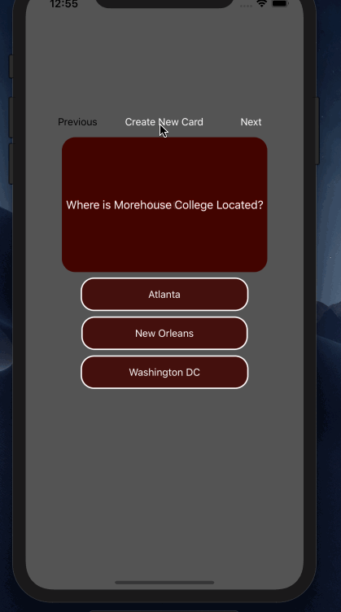

## Lab 3

### App Description
Flashcard Application

### App Walk-though

 

## Required
- [x] User can browse through multiple flashcards
- [x] User can re-open the app and see previously created flashcards
- [x] Push code to GitHub
## Optional
- [ ] User can delete a flashcard
- [ ] User can edit existing flashcard
- [x] User can store multiple choice questions
